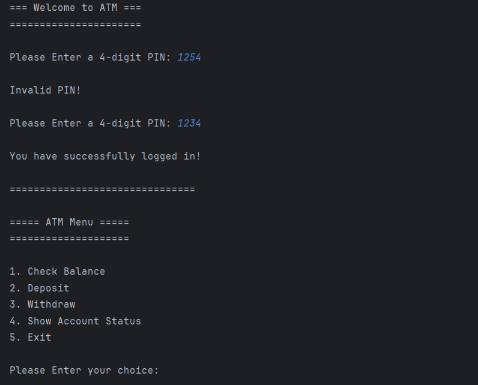
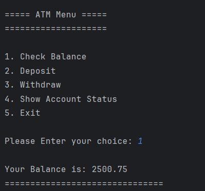
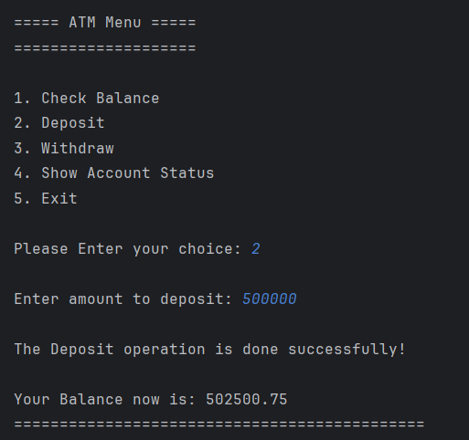
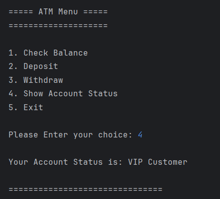
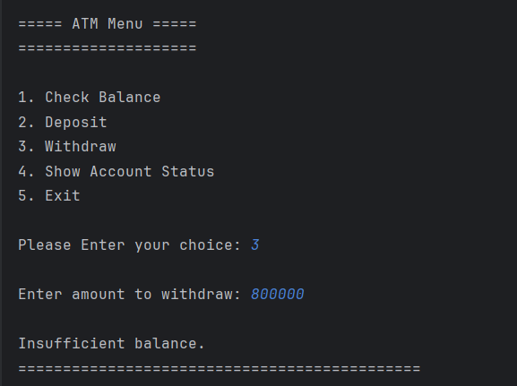
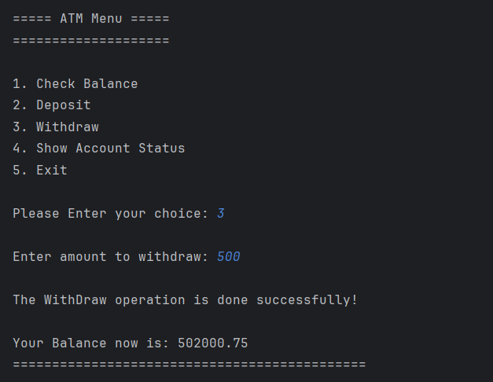
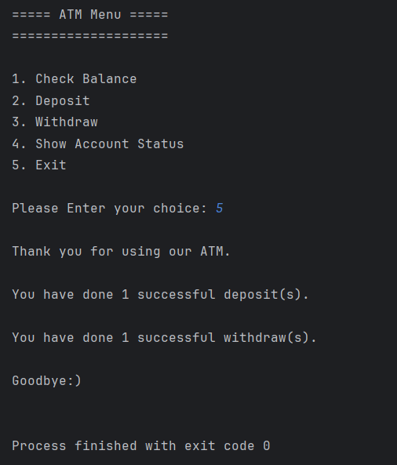

# 🏧 ATM System

A simple **Console-Based ATM System** built with **Java** that simulates the basic functionalities of an Automated Teller Machine (ATM). The project focuses on practicing Java fundamentals such as methods, loops, conditional statements, user input, and program organization.

---

## ✨ Features

- 🔐 Secure login with a 4-digit PIN.
- 🚫 Maximum of **3 login attempts** before the account is locked.
- 💰 Check current account balance.
- ➕ Deposit money into the account.
- ➖ Withdraw money with balance validation.
- 📊 Display account status based on the current balance.
- 📈 Count successful deposit and withdrawal transactions.
- ⚠️ Warn the user when the account balance reaches zero.
- 👋 Exit the application with a summary of successful transactions.

---

## 🛠️ Technologies Used

- Java
- Scanner Class
- IntelliJ IDEA

---

## 📂 Project Structure

```text
ATMAssignment/
│
├── src/
│   └── Main.java
│
├── Screenshots/
│   ├── login.png
│   ├── main-menu.png
│   ├── check-balance.png
│   ├── deposit.png
│   ├── withdraw.png
│   ├── account-status.png
│   └── exit.png
│
├── .gitignore
├── README.md
└── ATMAssignment.iml
```

---

## 🚀 Getting Started

### 1. Clone the repository

```bash
git clone https://github.com/your-username/ATMAssignment.git
```

### 2. Open the project

Open the project using **IntelliJ IDEA** or any Java IDE.

### 3. Run the application

Run the `Main.java` file.

### 4. Login

Use the following default PIN:

```text
1234
```

---

## 📋 ATM Menu

```text
===== ATM Menu =====

1. Check Balance
2. Deposit
3. Withdraw
4. Show Account Status
5. Exit
```

---

## 💳 Account Status

| Balance | Status |
|---------:|--------|
| ≥ 5000 | 👑 VIP Customer |
| 1000 - 4999.99 | 🙂 Regular Customer |
| < 1000 | ⚠️ Low Balance |

---

## 📸 Screenshots

| Login | Check Balance |
|-------|-----------|
|  | |

| Deposit | Account Status |
|--------------|----------|
|  |  |

| Withdraw1 | Withdraw2 |
|----------|----------------|
|  |  |

| Exit |
|------|
|  |

---

## 📖 Concepts Practiced

- Methods
- Parameters
- Return Values
- Variables
- Conditional Statements (`if`, `else if`, `else`)
- `switch`
- `do-while` Loop
- User Input using `Scanner`
- Console Application Design

---

## 🔮 Future Improvements

- Support multiple user accounts.
- Store account information in files or a database.
- Hide the PIN while typing.
- Display transaction history.
- Transfer money between accounts.
- Print transaction receipts.
- Add an Admin Panel.

---

## 👩‍💻 Author

**Menna AbdElGawad**

GitHub: https://github.com/Menna-AbdElGawad

---

⭐ If you found this project useful, don't forget to give it a **Star**!
